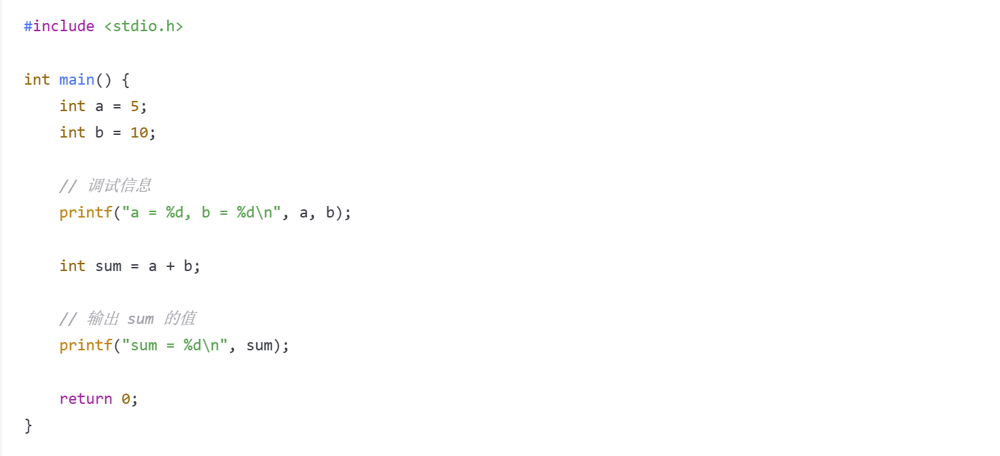
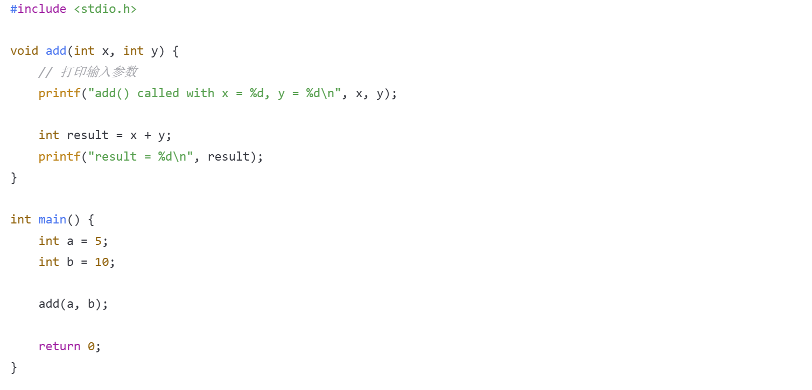
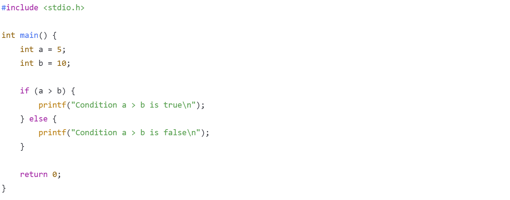
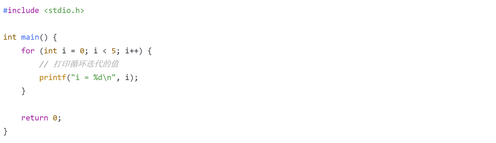
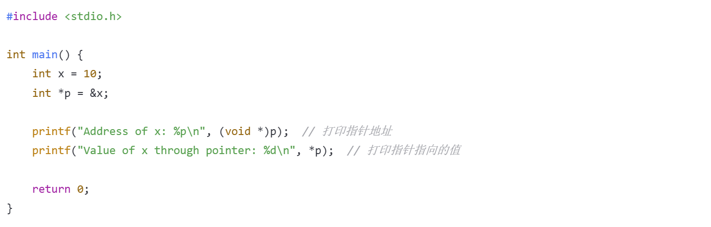
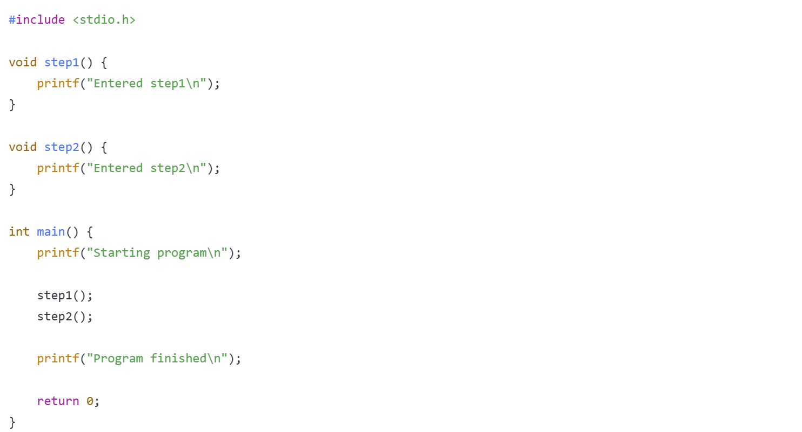

# 将printf用于调试

在代码编译过程中，难免会出现各种各样的问题，比如输出错误一类的问题。这种问题只从代码上来看一般不易发现，所以调试这一环节在 Debug 中尤为重要。使用 printf 输出某个变量的数值就是一种很好的观察程序错误点的方法。以下实际中情况下printf在调试中的应用。
### 基本的 printf 调试方法
最简单的 printf 调试方法就是在代码的关键地方插入 printf 语句，输出变量的值或其他有用的信息。：

### 打印函数调用的参数
在调试函数时，通常我们需要查看函数的输入参数。这时可以在函数开始时打印出函数的参数值：

### 打印条件判断的值
有时我们想知道程序在某些条件下是如何执行的。可以在条件判断语句中插入 printf，帮助追踪程序的执行流程：

### 在循环中打印调试信息
在循环内插入 printf 语句，可以帮助我们了解每次循环迭代时的变量变化：

### 调试内存地址和指针
如果你在处理指针时遇到问题，可以使用 printf 打印指针的值（即内存地址）以及指针指向的内容：

### 调试数组
在调试数组时，可以打印数组中的各个元素，特别是在循环或处理复杂数据结构时，检查数组元素的状态：

### 打印程序执行的路径（函数执行顺序）
当程序流程比较复杂时，可以通过 printf 输出每一步的执行路径，帮助你查看代码执行的顺序：

### 注意事项：
在使用 printf 进行调试时，将不再需要的 printf 语句移除，避免程序出现 PE 的状况。虽然 printf 是调试时非常有用的工具，但过多的调试输出会使程序变得难以阅读，甚至影响程序的性能。若想要避免这种状况，可以选择直接使用 IDE 中的调试工具进行调试。

### 总结
使用 printf 进行调试时，通常的做法是：
1.在关键位置（函数入口、变量赋值、条件判断、循环等）插入 printf 语句。
2.输出你关心的变量值、函数参数、执行路径、内存地址等信息。
3.清理不再需要的调试输出，避免影响程序的可读性和性能。
printf 调试是简单、直观的，但当程序变得更加复杂时，可以考虑使用专业的调试工具（如 GDB）进行更深入的调试。